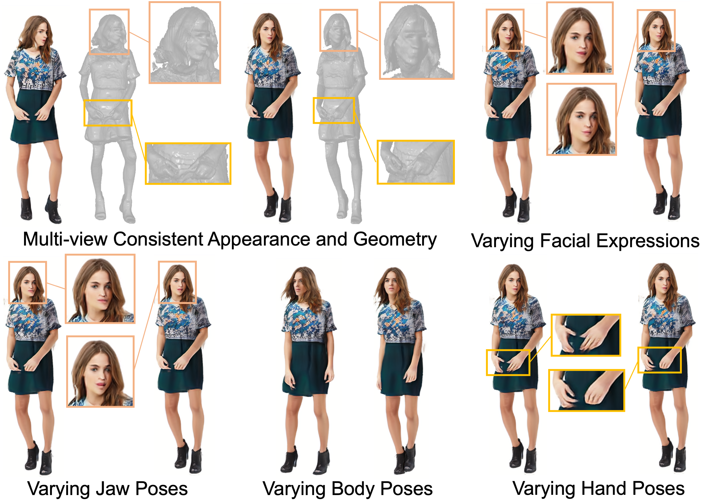

<!-- # showlab.github.io/xagen -->

<p align="center">

  <h2 align="center">XAGen: 3D Expressive Human Avatars Generation</h2>
  <p align="center">
    <a href="https://scholar.google.com/citations?user=-4iADzMAAAAJ&hl=en"><strong>Zhongcong Xu</strong></a>
    ·
    <a href="http://jeff95.me/"><strong>Jianfeng Zhang</strong></a>
    ·
    <a href="https://scholar.google.com.sg/citations?user=8gm-CYYAAAAJ&hl=en"><strong>Jun Hao Liew</strong></a>
    ·
    <a href="https://sites.google.com/site/jshfeng/home"><strong>Jiashi Feng</strong></a>
    ·
    <a href="https://sites.google.com/view/showlab"><strong>Mike Zheng Shou</strong></a>
    <br>
    <br>
        <a href="https://arxiv.org/abs/2311.13574">
        
        </a>
        <a href='https://showlab.github.io/xagen'>
        
        </a>
  </p>
  
  <table align="center">
    <td>
      <p align="center">
        
      </p>
    </td>
  </table>

*Introducing XAGen, a 3D-aware generative model that enables human synthesis with high-fidelity appearance and geometry, together with disentangled controllability for body, face, and hand.*

### *For high-quality human image animation, please also check our latest work <a href="https://github.com/magic-research/magic-animate">MagicAnimate</a>!*

## Citing
If you find our work useful, please consider citing:
```BibTeX
@inproceedings{XAGen2023,
    title={XAGen: 3D Expressive Human Avatars Generation},
    author={Xu, Zhongcong and Zhang, Jianfeng and Liew, Junhao and Feng, Jiashi and Shou, Mike Zheng},
    booktitle={NeurIPS},
    year={2023}
}
```

